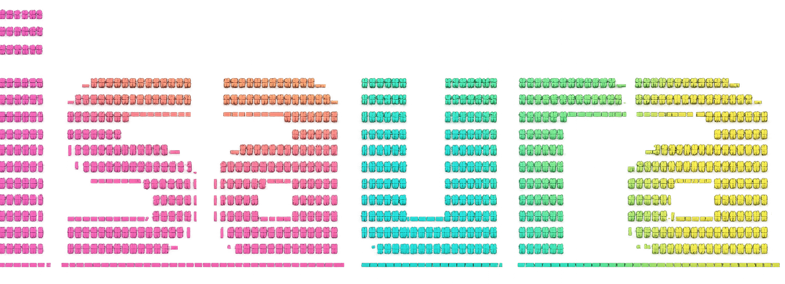

<div align="center">



### Ersilia's Precalculation Store

Fast, reproducible access to **precalculated model outputs** from the **Ersilia Model Hub** — with a CLI and Python API built for batch workflows.

<br/>

[](#)
[](https://docs.astral.sh/uv/)
[](https://www.docker.com/)
[](https://github.com/psf/black)
[](#license)

<br/>

[Installation](#installation) ·
[CLI](#cli) ·
[Python API](#python-api) ·
[Configuration](#configuration) ·
[Docs](#docs) ·
[Contributing](#contributing)

</div>

---

## Why Isaura?
Isaura is Ersilia's precalculation store: it **persistently stores model outputs** so researchers can retrieve results instantly instead of repeatedly running time-consuming inference. This delivers a major research speed-up — especially in low-resource settings where compute, bandwidth, or infrastructure are limited — by turning repeated calculations into reusable shared artifacts. To support equitable access, Ersilia also provides **free access to public precalculations**, making high-value model outputs available even when local compute isn't.

Isaura provides a structured store for model results so you can:

- ⚡ **Skip recomputation** by reusing precalculated outputs
- 🧱 Keep artifacts **versioned and organized** (model → version → bucket/project)
- 📦 Store and retrieve results via **S3-compatible object storage (MinIO)**
- 🔎 Enable **fast retrieval** using its engine built on top of DuckDB

---

## Installation

### Prerequisites

- **Python 3.10+** — [download here](https://www.python.org/downloads/)
- **Git** — [download here](https://git-scm.com/downloads)
- **Docker Desktop** — [download here](https://www.docker.com/products/docker-desktop/) — must be open before starting local services

---

### Step 1 — Clone and install

```bash
git clone https://github.com/ersilia-os/isaura.git
cd isaura
pip install -e .
```

> **Using uv?** Run `uv sync` instead and activate the environment with `source .venv/bin/activate`.

A local configuration file is created automatically at `~/.isaura/.env` with sensible defaults the first time you run any `isaura` command.

---

### Step 2 — Start local services

Make sure Docker Desktop is open, then run:

```bash
isaura engine --start
```

This starts a local MinIO instance and automatically creates the `isaura-public` and `isaura-private` buckets. You can explore the MinIO console at `http://localhost:9001` (user: `minioadmin123`, password: `minioadmin1234`).

---

### Step 3 — (Optional) Set up remote credentials

If you have access to Ersilia's remote store, add your cloud credentials interactively:

```bash
isaura configure --remote
```

You will be prompted for the cloud endpoint and access keys. Credentials are saved locally to `~/.isaura/.env` — nothing is sent anywhere.

---

### Step 4 — Verify your setup

```bash
isaura configure --test-credentials
```

This checks connectivity for local and cloud (if configured) and prints a result table. All rows you care about should show `✓ connected`.

```
┏━━━━━━━━━━━━━━━┳━━━━━━━━━━━━━━━━┳━━━━━━━━━━━━━┓
┃ Target        ┃ Bucket         ┃ Result      ┃
┡━━━━━━━━━━━━━━━╇━━━━━━━━━━━━━━━━╇━━━━━━━━━━━━━┩
│ Local         │ isaura-public  │ ✓ connected │
│ Cloud public  │ isaura-public  │ ✓ connected │
│ Cloud private │ isaura-private │ ✓ connected │
└───────────────┴────────────────┴─────────────┘
```

---

## CLI

### Managing configuration

```bash
isaura configure                     # show current configuration
isaura configure --remote            # add or update remote/cloud credentials
isaura configure --update            # update a single credential interactively
isaura configure --show-secrets      # show all credential values unmasked
isaura configure --test-credentials  # test local and cloud connectivity
```

### Managing local services

```bash
isaura engine           # show status of Docker and MinIO
isaura engine --start   # start local MinIO
isaura engine --stop    # stop local MinIO
```

### Common data commands

#### Write (store outputs)

```bash
isaura write -i data/ersilia_output.csv -m eos8a4x -v v2 -pn myproject --access public
```

#### Read (retrieve outputs)

```bash
isaura read -i data/inputs.csv -m eos8a4x -v v2 -pn myproject -o data/outputs.csv
```

#### Copy artifacts to a local directory

```bash
isaura copy -m eos8a4x -v v1 -pn myproject -o ~/Documents/isaura-backup/
```

#### Inspect available entries

```bash
isaura inspect -m eos8a4x -v v1 -o reports/available.csv
```

#### Upload to cloud store

The cloud only hosts two canonical buckets: `isaura-public` and `isaura-private`. If your local work uses a custom project name, copy or move it into the appropriate canonical bucket first, then push.

**Step 1 — write outputs to your local project:**

```bash
isaura write -i data/ersilia_output.csv -m eos8a4x -v v1 -pn myproject --access public
```

**Step 2 — copy (or move) into the canonical bucket:**

```bash
# copy (keeps data in myproject as well)
isaura copy -m eos8a4x -v v1 -pn myproject

# or move (removes data from myproject after copying)
isaura move -m eos8a4x -v v1 -pn myproject
```

**Step 3 — push to cloud:**

```bash
isaura push -m eos8a4x -v v1 -pn isaura-public
# or for private data:
isaura push -m eos8a4x -v v1 -pn isaura-private
```

> Cloud credentials must be configured first with `isaura configure --remote`.

---

## Python API

```python
from isaura.manage import IsauraWriter, IsauraReader
```

Write a precalculation:

```python
writer = IsauraWriter(
    input_csv="data/input.csv",
    model_id="eos8a4x",
    model_version="v1",
    bucket="my-project",
    access="public",
)
writer.write()
```

Read stored results:

```python
reader = IsauraReader(
    model_id="eos8a4x",
    model_version="v1",
    bucket="my-project",
    input_csv="data/query.csv",
    approximate=False,
)
reader.read(output_csv="results.csv")
```

More examples: **[API and CLI usage →](docs/API_AND_CLI_USAGE.md)**

---

## Configuration

Configuration is stored in `~/.isaura/.env` and created automatically on first run. You can view or update it at any time with:

```bash
isaura configure                 # view current config
isaura configure --update        # update any value interactively
isaura configure --remote        # add cloud credentials
```

See the full list of available variables: **[CONFIGURATION →](docs/CONFIGURATION.md)**

---

## Docs

* 📘 **How it works**: [here](docs/HOW_IT_WORKS.md)
* ⚙️ **Configuration**: [here](docs/CONFIGURATION.md)
* 🧰 **CLI and API reference**: [here](docs/API_AND_CLI_USAGE.md)
* 🧪 **Benchmark**: [here](docs/BENCHMARK.md)
* 🩹 **Troubleshooting / recovery**: [here](docs/TROUBLESHOOTING.md)

---

## Contributing

PRs are welcome. Please run format + lint before pushing:

```bash
uv run ruff format .
```

If you're changing CLI behavior, please update **[here](docs/API_AND_CLI_USAGE.md)**.

---

## About the Ersilia Open Source Initiative

The [Ersilia Open Source Initiative](https://ersilia.io) is a tech-nonprofit organization fueling sustainable research in the Global South. Ersilia's main asset is the [Ersilia Model Hub](https://github.com/ersilia-os/ersilia), an open-source repository of AI/ML models for antimicrobial drug discovery.


