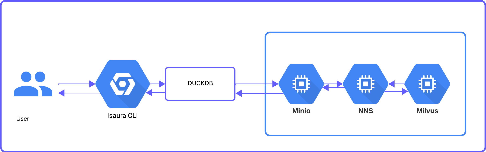

## How it works

<p align="center">
  <br><br>
</p>


### Write / ingest
- Accepts **Ersilia outputs format** for any model
- Uses **PyArrow** to produce Parquet chunks stored in **MinIO** (S3-compatible object storage)
- Deduplicates inputs using a **Bloom filter** before writing

### Read / fetch
You provide a **CSV file** containing a list of inputs.

- Isaura uses **DuckDB** to query Parquet directly from MinIO
- Returns results in **Ersilia outputs format**

---

## Architecture

- User interacts through the **Isaura CLI** or **Python API**
- **DuckDB** is the query engine over Parquet for exact retrieval
- **MinIO** stores Parquet data, Bloom filters, and index files
- **Approximate search** (Milvus/NNS) is available in the Python API but disabled in the CLI

---

## Projects (buckets)

Isaura organizes data in **projects**, backed by MinIO buckets.

### Canonical buckets
- `isaura-public` — finalized, publicly accessible precalculations
- `isaura-private` — finalized, restricted precalculations

### Project buckets
Custom project buckets (e.g. `ersilia-hiv`) are **staging areas**. You write data there first, then use `isaura persist` to route molecules into the canonical buckets based on their access tag (`public` → `isaura-public`, `private` → `isaura-private`).

---

## Storage layout

Example structure for a single model and version:

```
<bucket>/
  eos8a4x/
    v1/
      tranches/
        bloom.pkl           ← Bloom filter for fast membership checks
        index.json          ← maps molecule → (row, chunk) coordinates
        access.json         ← access tag per molecule (public/private)
        catalog.json        ← entry count + chunk count metadata
        data/
          col=A/row=0/
            chunk_0.parquet
            chunk_1.parquet
            ...
```

---

## Parquet chunking

Chunk size depends on the model's **number of output columns**:

| Model type | Output columns | Max rows per chunk |
|---|---|---|
| Narrow | < 100 | 2,000,000 |
| Wide | ≥ 100 | 100,000 |

This keeps individual files at a manageable size — a model with 500 output columns × 2M rows would produce an extremely large file. Smaller chunks also allow isaura to download only the files that contain your query molecules.

---

## Fast membership checks (Bloom filter)

Isaura keeps a Bloom filter per `(bucket, model, version)` at:

```
<bucket>/<model_id>/<version>/tranches/bloom.pkl
```

This allows Isaura to quickly rule out missing inputs before doing any Parquet scans.

> Bloom filters may produce false positives, but never false negatives.

---

## Access control with `access.json`

Each `(bucket, model, version)` stores:

```
<bucket>/<model_id>/<version>/tranches/access.json
```

This file records each molecule's access classification (`public` or `private`). When you run `isaura persist`, isaura reads this file and routes molecules to `isaura-public` or `isaura-private` accordingly.

---

## Persisting into canonical buckets

When you run `isaura persist -m eos8a4x -v v1 -pn myproject`, isaura:

1. Reads `myproject/eos8a4x/v1/tranches/access.json`
2. For each molecule, routes it to `isaura-public` or `isaura-private` based on its access tag
3. Updates the Bloom filter and index in the destination bucket
4. Uploads an updated `catalog.json`
